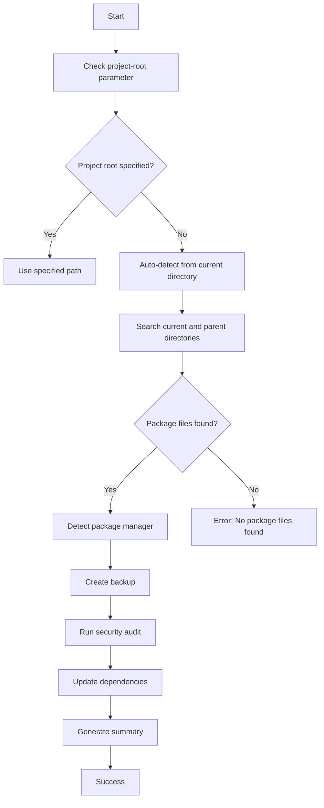

# Shell Scripts for Nitrokit

This directory contains automation scripts for managing various aspects of the Nitrokit project. All scripts are designed to be self-contained with auto-installation features and comprehensive help documentation.

## 📋 Available Scripts

| Script                                                         | Purpose               | Description                                                        |
| -------------------------------------------------------------- | --------------------- | ------------------------------------------------------------------ |
| [`sync_translations_gemini.sh`](./sync_translations_gemini.sh) | 🌍 AI Translation     | Advanced AI-powered translation automation using Google Gemini API |
| [`sync_translations.sh`](./sync_translations.sh)               | 🔄 Basic Translation  | Simple translation synchronization without external dependencies   |
| [`labels.sh`](./labels.sh)                                     | 🏷️ GitHub Labels      | GitHub issue label management with emojis and categorization       |
| [`dependency_updater.sh`](./dependency_updater.sh)             | 📦 Dependency Updates | Automated package updates with security checks and backup support  |

## 🚀 Quick Start

### Prerequisites

- **macOS/Linux/Windows** - Cross-platform support
- **Bash shell** - Available by default on most systems
- **Internet connection** - For API calls and downloads

### Auto-Installation

All scripts include intelligent auto-installation features:

- **Dependency detection** - Automatically checks for required tools
- **Platform-specific installation** - Supports multiple package managers
- **Authentication setup** - Guides through API key and GitHub setup
- **Graceful fallbacks** - Clear instructions when auto-install fails

## 📖 Detailed Script Documentation

### 🌍 AI Translation Script (`sync_translations_gemini.sh`)

Advanced translation automation using Google Gemini AI with enterprise-grade features.

**Key Features:**

- 🤖 **AI-powered translations** - Supports 30+ languages automatically
- 🔍 **Smart key detection** - Identifies new translation keys in source files
- ⚡ **Rate limiting** - Built-in delays to respect API limits
- ✨ **Auto-formatting** - Prettier integration for consistent code style
- 🔧 **Multiple configurations** - Environment variables, CLI params, .env files
- 🛡️ **Error handling** - Robust error recovery and reporting

**Quick Usage:**

```bash
# Using environment variable
export GEMINI_API_KEY="your-api-key"
./sync_translations_gemini.sh

# Using command line parameters
./sync_translations_gemini.sh --api-key "your-key" --model "gemini-1.5-pro"

# Custom delay for rate limiting
./sync_translations_gemini.sh --delay 3
```

**Configuration Options:**

```bash
./sync_translations_gemini.sh --help  # Full documentation
./sync_translations_gemini.sh --api-key KEY --model MODEL --delay SECONDS
```

### 🔄 Basic Translation Script (`sync_translations.sh`)

Lightweight translation synchronization without external API dependencies.

**Key Features:**

- 🚫 **No API required** - Works completely offline
- 📋 **Key synchronization** - Adds new keys across all language files
- 🔧 **Configurable paths** - Custom directories and file names
- 🔍 **Dry run mode** - Preview changes before applying
- ✨ **Optional formatting** - Prettier integration (can be disabled)
- 📊 **Detailed reporting** - Statistics and progress tracking

**Quick Usage:**

```bash
# Basic usage with defaults
./sync_translations.sh

# Custom configuration
./sync_translations.sh --messages-dir "locales" --source-file "en.json"

# Preview changes without applying
./sync_translations.sh --dry-run

# Skip formatting
./sync_translations.sh --no-format
```

**Configuration Options:**

```bash
./sync_translations.sh --help  # Full documentation
./sync_translations.sh --messages-dir DIR --source-file FILE --reference-file FILE
```

### 🏷️ GitHub Labels Script (`labels.sh`)

Comprehensive GitHub repository label management with automation and best practices.

**Key Features:**

- 🔧 **Auto-installs GitHub CLI** - Cross-platform installation support
- 🎨 **Emoji integration** - Updates existing labels with emojis
- 🏷️ **Nitrokit-specific labels** - Translation, AI, and component labels
- 🔄 **Multiple modes** - Update-only, dry-run, list-only options
- 🛡️ **Authentication handling** - Automatic GitHub login flow
- 📊 **Organized categories** - Bug tracking, priorities, status, components

**Quick Usage:**

```bash
# Full setup with auto-installation
./labels.sh

# Preview changes only
./labels.sh --dry-run

# List current labels
./labels.sh --list-only

# Update existing labels only
./labels.sh --update-only
```

**Available Label Categories:**

- 🐛 **Bug tracking** - `🐛 bug`, `❌ invalid`
- ✨ **Enhancements** - `✨ enhancement`, `🚀 feature`
- 🔴 **Priorities** - `🔴 critical`, `🟠 high`, `🟡 medium`, `🟢 low`
- 🔄 **Status** - `🔄 in progress`, `👀 needs review`, `🚫 blocked`
- 🎯 **Components** - `🎨 ui/ux`, `🌍 translation`, `🤖 gemini-api`
- 🌱 **Difficulty** - `🌱 easy`, `🌿 medium`, `🌳 hard`

### 📦 Dependency Updater Script (`dependency_updater.sh`)

Automated package management with security vulnerability scanning and intelligent backup system.

**Key Features:**

- 🔍 **Multi-package manager support** - npm, yarn, pnpm, cargo, go, pip, composer
- 🛡️ **Security vulnerability scanning** - Built-in audit tools for each package manager
- 💾 **Automatic backup system** - Rollback capability with timestamped backups
- 🎯 **Update strategies** - Safe, patch, minor, major, and all update modes
- 🔍 **Auto-detection** - Automatically finds project root and package manager
- 🧪 **Dry run mode** - Preview changes without applying them
- 🔄 **Cross-platform** - Supports macOS, Linux, and Windows (WSL)

**Quick Usage:**

```bash
# Auto-detect everything and perform safe updates
./dependency_updater.sh

# Use parent directory with dry run
./dependency_updater.sh --project-root .. --dry-run

# Major updates without security checks
./dependency_updater.sh --update-mode major --no-security

# Restore from backup
./dependency_updater.sh --restore 20250525_003649

# List available backups
./dependency_updater.sh --list-backups
```

**Update Modes:**

- 🔒 **safe** - Only security updates and patch versions (default)
- 🔧 **patch** - Patch version updates only (1.0.1 → 1.0.2)
- ⚡ **minor** - Minor and patch updates (1.0.x → 1.1.x)
- 🚀 **major** - Major version updates (1.x.x → 2.x.x)
- 🌟 **all** - Update everything to latest versions

**Supported Package Managers:**

| Package Manager | Files Detected                    | Security Audit | Auto-Install |
| --------------- | --------------------------------- | -------------- | ------------ |
| 🟢 **npm**      | `package.json`                    | `npm audit`    | ✅           |
| 🟢 **yarn**     | `package.json` + `yarn.lock`      | `yarn audit`   | ✅           |
| 🟢 **pnpm**     | `package.json` + `pnpm-lock.yaml` | `pnpm audit`   | ✅           |
| 🟢 **cargo**    | `Cargo.toml`                      | `cargo audit`  | ✅           |
| 🟢 **go**       | `go.mod`                          | Manual check   | ❌           |
| 🟢 **pip**      | `requirements.txt`, `setup.py`    | `safety check` | ✅           |
| 🟢 **composer** | `composer.json`                   | Manual check   | ✅           |

**Backup Management:**

```bash
# List all available backups
./dependency_updater.sh --list-backups

# Restore specific backup
./dependency_updater.sh --restore 20250525_003649

# Clean old backups (keeps last 5)
./dependency_updater.sh --clean-backups
```

**Configuration Options:**

```bash
./dependency_updater.sh --help  # Full documentation

# All available options
./dependency_updater.sh \
  --package-manager npm \
  --update-mode major \
  --project-root .. \
  --backup-dir .dependency_backup \
  --security-check \
  --dry-run
```

## 🔄 Translation Workflow Comparison

| Feature                 | Basic Script        | AI Script            |
| ----------------------- | ------------------- | -------------------- |
| **API Requirements**    | None                | Gemini API Key       |
| **Translation Method**  | Manual placeholder  | Automatic AI         |
| **Supported Languages** | All JSON files      | 30+ predefined       |
| **Formatting**          | Optional Prettier   | Integrated Prettier  |
| **Rate Limiting**       | Not applicable      | Built-in delays      |
| **Configuration**       | Simple CLI params   | Multiple methods     |
| **Best Use Case**       | Development/Testing | Production ready     |
| **Offline Capability**  | ✅ Full offline     | ❌ Requires internet |
| **Setup Complexity**    | Minimal             | Moderate             |

### Choosing the Right Translation Script

**Use `sync_translations.sh` when:**

- 🧪 **Development environment** - Testing and prototyping
- 🔒 **Restricted networks** - No external API access
- 👥 **Manual review required** - Human translation preferred
- 🚀 **Quick iteration** - Fast key synchronization needed
- 💰 **Budget constraints** - No API costs

**Use `sync_translations_gemini.sh` when:**

- 🤖 **Production deployment** - Professional translation quality
- 🌍 **Multi-language support** - Need many languages quickly
- ⚡ **Large scale** - Batch processing hundreds of keys
- 🎯 **Quality consistency** - AI ensures uniform tone
- 📈 **Time efficiency** - Automated workflow preferred

## 📦 Dependency Management Workflow

### Package Manager Detection Flow



### Update Strategy Decision Matrix

| Current Version | Safe Mode | Patch Mode | Minor Mode | Major Mode | All Mode |
| --------------- | --------- | ---------- | ---------- | ---------- | -------- |
| 1.0.0           | 1.0.1     | 1.0.x      | 1.x.x      | 2.x.x      | latest   |
| 1.5.2           | 1.5.3     | 1.5.x      | 1.x.x      | 2.x.x      | latest   |
| 2.1.0           | 2.1.1     | 2.1.x      | 2.x.x      | 3.x.x      | latest   |

### Security Audit Integration

The dependency updater integrates security scanning for each package manager:

- **npm/yarn/pnpm**: Uses built-in `audit` commands to check for vulnerabilities
- **cargo**: Installs and uses `cargo-audit` for Rust security advisories
- **pip**: Uses `safety` tool to check Python package vulnerabilities
- **go/composer**: Manual security recommendations and update notifications

## 🛠️ Development Guidelines

### Adding New Scripts

When contributing new automation scripts:

1. **Naming Convention**: Use `action_description.sh` format
2. **Auto-Installation**: Include dependency checks and installation
3. **Help Documentation**: Comprehensive `--help` functionality
4. **Error Handling**: Graceful failures with actionable messages
5. **Cross-Platform**: Test on macOS, Linux, and Windows (WSL)
6. **Parameter Support**: Accept configuration via CLI and environment

### Script Template

```bash
#!/bin/bash

# script_name.sh - Brief description with purpose

# Default configuration
DEFAULT_PARAM="default_value"
PARAM="${PARAM:-$DEFAULT_PARAM}"

# Color definitions
RED='\033[0;31m'
GREEN='\033[0;32m'
YELLOW='\033[1;33m'
BLUE='\033[0;34m'
PURPLE='\033[0;35m'
NC='\033[0m' # No Color

# Help function
show_help() {
    cat << EOF
🎯 Script Name - Brief Description

USAGE:
    ./script_name.sh [OPTIONS]

DESCRIPTION:
    Detailed description of what the script does and its purpose.

OPTIONS:
    --param VALUE    Parameter description (default: $DEFAULT_PARAM)
    -h, --help       Show this help message and exit

EXAMPLES:
    ./script_name.sh                    # Basic usage
    ./script_name.sh --param "value"    # Custom parameter

EOF
}

# Parse command line arguments
while [[ $# -gt 0 ]]; do
    case $1 in
        --param)
            PARAM="$2"
            shift 2
            ;;
        -h|--help)
            show_help
            exit 0
            ;;
        *)
            echo -e "${RED}❌ Unknown parameter: $1${NC}"
            echo -e "${BLUE}💡 For help: $0 --help${NC}"
            exit 1
            ;;
    esac
done

# Logging functions
log_info() {
    echo -e "${BLUE}ℹ️  $1${NC}"
}

log_success() {
    echo -e "${GREEN}✅ $1${NC}"
}

log_warning() {
    echo -e "${YELLOW}⚠️  $1${NC}"
}

log_error() {
    echo -e "${RED}❌ $1${NC}"
}

log_step() {
    echo -e "${PURPLE}🔄 $1${NC}"
}

# Function to check dependencies
check_dependencies() {
    if ! command -v required_tool &> /dev/null; then
        log_error "Required tool not found"
        # Auto-installation logic here
        exit 1
    fi
}

# Main script logic
main() {
    log_step "Starting [Script Name]..."
    check_dependencies

    # Your script logic here

    log_success "Process completed successfully!"
}

# Run main function
main "$@"
```

### Best Practices

- ✅ **Comprehensive help** - Include examples and troubleshooting
- ✅ **Parameter validation** - Check inputs before processing
- ✅ **Progress indicators** - Show status with emojis and messages
- ✅ **Error recovery** - Provide clear next steps on failures
- ✅ **Configuration flexibility** - Support multiple input methods
- ✅ **Resource cleanup** - Clean temporary files and processes

## 🔧 Troubleshooting Guide

### Common Issues and Solutions

| Issue                      | Symptoms                  | Solution                              |
| -------------------------- | ------------------------- | ------------------------------------- |
| **Permission Denied**      | `bash: permission denied` | Run `chmod +x script_name.sh`         |
| **Command Not Found**      | `command not found`       | Scripts auto-install dependencies     |
| **API Rate Limits**        | Translation failures      | Increase `--delay` parameter          |
| **GitHub Auth Failed**     | Authentication errors     | Run `gh auth login` manually          |
| **Invalid JSON**           | Parsing errors            | Validate JSON with `jq '.' file.json` |
| **Missing Dependencies**   | Tool not found errors     | Follow auto-installation prompts      |
| **Package Manager Issues** | Update failures           | Check `--project-root` parameter      |
| **Backup Restore Failed**  | File permission errors    | Ensure write access to project files  |

### Debug Mode

Enable verbose logging for troubleshooting:

```bash
# Enable debug mode
set -x
./script_name.sh
set +x

# Check script execution
bash -x ./script_name.sh
```

### Getting Help

All scripts provide comprehensive help:

```bash
# Show detailed help
./script_name.sh --help
./script_name.sh -h

# Check available options
./script_name.sh --invalid-option  # Shows help automatically
```

## 📁 Project Structure

```
shell/
├── README.md                     # This comprehensive guide
├── sync_translations_gemini.sh   # AI-powered translation automation
├── sync_translations.sh          # Basic translation synchronization
├── labels.sh                     # GitHub label management
├── dependency_updater.sh         # Automated package updates with security
└── [future_scripts/]             # Planned automation tools
    ├── test_runner.sh            # Comprehensive testing
    ├── deployment.sh             # One-click deployment
    ├── changelog_generator.sh    # Automated release notes
    └── code_formatter.sh         # Code style enforcement
```

### Backup Structure

```
nitrokit/
├── .dependency_backup/          # Automated dependency backups
│   ├── 20250525_003649/
│   │   ├── package.json
│   │   ├── package-lock.json
│   │   └── .backup_info        # Backup metadata
│   └── 20250525_120430/
├── package.json                 # Main project dependencies
├── shell/                       # Script directory
│   ├── dependency_updater.sh
│   └── README.md
└── other_project_files/
```

## 🤝 Contributing

### Contribution Workflow

1. **Fork and Clone** - Create your own copy of the repository
2. **Create Script** - Follow the template and guidelines above
3. **Test Thoroughly** - Verify on different platforms and package managers
4. **Update Documentation** - Add to this README with examples
5. **Submit Pull Request** - Include detailed description

### Planned Features

Future automation opportunities:

- 🧪 **Testing Automation** - Comprehensive test running with reporting
- 🚀 **Deployment Automation** - One-click deployment with rollback support
- 📊 **Analytics Collection** - Project metrics and usage statistics
- 🔍 **Code Quality Tools** - Linting, formatting, and security scanning
- 📝 **Documentation Generation** - Automated changelog and API docs
- 🔄 **CI/CD Integration** - GitHub Actions workflow management
- 🏗️ **Environment Setup** - Development environment bootstrapping
- 🔐 **Security Automation** - Vulnerability scanning and patching

## 📞 Support and Resources

- 🐛 **Bug Reports**: [GitHub Issues](https://github.com/mustafagenc/nitrokit/issues)
- 💬 **Feature Requests**: [GitHub Discussions](https://github.com/mustafagenc/nitrokit/discussions)
- 📧 **Direct Contact**: [eposta@mustafagenc.info](mailto:eposta@mustafagenc.info)
- 📚 **Documentation**: [Project Wiki](https://github.com/mustafagenc/nitrokit/wiki)
- 🔧 **API Reference**: [Google AI Studio](https://makersuite.google.com/)

---

**💡 Pro Tip**: All scripts are designed to be self-documenting and user-friendly. When in doubt, use `--help` for comprehensive guidance and examples!

**🎯 Quick Commands**:

```bash
# Get help for any script
./script_name.sh --help

# Preview changes before applying
./script_name.sh --dry-run

# Check what scripts are available
ls -la *.sh

# Quick dependency update with backup
./dependency_updater.sh --dry-run  # Preview first
./dependency_updater.sh            # Apply changes

# Emergency backup restore
./dependency_updater.sh --list-backups
./dependency_updater.sh --restore BACKUP_ID
```
