# Shell Scripts for Nitrokit

This directory contains automation scripts for managing various aspects of the Nitrokit project. All scripts are designed to be self-contained with auto-installation features and comprehensive help documentation.

## 📋 Available Scripts

| Script                                                         | Purpose               | Description                                                        |
| -------------------------------------------------------------- | --------------------- | ------------------------------------------------------------------ |
| [`sync_translations_gemini.sh`](./sync_translations_gemini.sh) | 🌍 AI Translation     | Advanced AI-powered translation automation using Google Gemini API |
| [`sync_translations.sh`](./sync_translations.sh)               | 🔄 Basic Translation  | Simple translation synchronization without external dependencies   |
| [`labels.sh`](./labels.sh)                                     | 🏷️ GitHub Labels      | GitHub issue label management with emojis and categorization       |
| [`dependency_updater.sh`](./dependency_updater.sh)             | 📦 Dependency Updates | Automated package updates with security checks and backup support  |
| [`dev-setup.sh`](./dev-setup.sh)                               | 🛠️ Development Setup  | One-click development environment setup with Prisma optimization   |

## 🚀 Quick Start

### Prerequisites

- **macOS/Linux/Windows** - Cross-platform support
- **Bash shell** - Available by default on most systems
- **Internet connection** - For API calls and downloads

### Auto-Installation

All scripts include intelligent auto-installation features:

- **Dependency detection** - Automatically checks for required tools
- **Platform-specific installation** - Supports multiple package managers
- **Authentication setup** - Guides through API key and GitHub setup
- **Graceful fallbacks** - Clear instructions when auto-install fails

## 📖 Detailed Script Documentation

### 🛠️ Development Setup Script (`dev-setup.sh`)

One-click development environment setup with intelligent dependency management and Prisma optimization.

**Key Features:**

- 🎯 **Smart project detection** - Automatically finds project root from shell directory
- 📦 **Package manager detection** - Supports yarn, pnpm, and npm with auto-selection
- 🗃️ **Prisma optimization** - Handles database setup with production-optimized client generation
- 🔧 **Environment configuration** - Auto-creates .env from .env.example
- 🧹 **Cache management** - Cleans corrupted Prisma client cache automatically
- ✅ **Health checks** - Validates Next.js configuration and project structure

**Quick Usage:**

```bash
# Complete development environment setup
./dev-setup.sh

# Script automatically handles:
# - Package installation (yarn/pnpm/npm)
# - Database migrations (if Prisma exists)
# - Prisma client generation with --no-engine flag
# - Environment file creation
# - Cache cleanup if needed
```

**What It Does:**

1. **Detects project structure** - Finds nitrokit root directory from shell/
2. **Installs dependencies** - Uses preferred package manager (yarn > pnpm > npm)
3. **Sets up Prisma** - Runs migrations and generates optimized client
4. **Configures environment** - Creates .env from .env.example if needed
5. **Validates setup** - Checks Next.js config and project health
6. **Provides guidance** - Shows available development commands

**Prisma Optimization:**

```bash
# Automatically runs these commands:
npx prisma migrate dev --name init  # Database migrations
npx prisma generate --no-engine     # Production-optimized client
```

**Environment Variables Handled:**

- Creates `.env` from `.env.example` if missing
- Validates database connection requirements
- Shows warnings for missing configuration

### 🌍 AI Translation Script (`sync_translations_gemini.sh`)

Advanced translation automation using Google Gemini AI with enterprise-grade features.

**Key Features:**

- 🤖 **AI-powered translations** - Supports 30+ languages automatically
- 🔍 **Smart key detection** - Identifies new translation keys in source files
- ⚡ **Rate limiting** - Built-in delays to respect API limits
- ✨ **Auto-formatting** - Prettier integration for consistent code style
- 🔧 **Multiple configurations** - Environment variables, CLI params, .env files
- 🛡️ **Error handling** - Robust error recovery and reporting

**Quick Usage:**

```bash
# Using environment variable
export GEMINI_API_KEY="your-api-key"
./sync_translations_gemini.sh

# Using command line parameters
./sync_translations_gemini.sh --api-key "your-key" --model "gemini-1.5-pro"

# Custom delay for rate limiting
./sync_translations_gemini.sh --delay 3
```

### 🔄 Basic Translation Script (`sync_translations.sh`)

Lightweight translation synchronization without external API dependencies.

**Key Features:**

- 🚫 **No API required** - Works completely offline
- 📋 **Key synchronization** - Adds new keys across all language files
- 🔧 **Configurable paths** - Custom directories and file names
- 🔍 **Dry run mode** - Preview changes before applying
- ✨ **Optional formatting** - Prettier integration (can be disabled)
- 📊 **Detailed reporting** - Statistics and progress tracking

**Quick Usage:**

```bash
# Basic usage with defaults
./sync_translations.sh

# Custom configuration
./sync_translations.sh --messages-dir "locales" --source-file "en.json"

# Preview changes without applying
./sync_translations.sh --dry-run
```

### 🏷️ GitHub Labels Script (`labels.sh`)

Comprehensive GitHub repository label management with automation and best practices.

**Key Features:**

- 🔧 **Auto-installs GitHub CLI** - Cross-platform installation support
- 🎨 **Emoji integration** - Updates existing labels with emojis
- 🏷️ **Nitrokit-specific labels** - Translation, AI, and component labels
- 🔄 **Multiple modes** - Update-only, dry-run, list-only options
- 🛡️ **Authentication handling** - Automatic GitHub login flow
- 📊 **Organized categories** - Bug tracking, priorities, status, components

**Quick Usage:**

```bash
# Full setup with auto-installation
./labels.sh

# Preview changes only
./labels.sh --dry-run

# List current labels
./labels.sh --list-only
```

### 📦 Dependency Updater Script (`dependency_updater.sh`)

Automated package management with security vulnerability scanning and intelligent backup system.

**Key Features:**

- 🔍 **Multi-package manager support** - npm, yarn, pnpm, cargo, go, pip, composer
- 🛡️ **Security vulnerability scanning** - Built-in audit tools for each package manager
- 💾 **Automatic backup system** - Rollback capability with timestamped backups
- 🎯 **Update strategies** - Safe, patch, minor, major, and all update modes
- 🔍 **Auto-detection** - Automatically finds project root and package manager
- 🧪 **Dry run mode** - Preview changes without applying them
- 🔄 **Cross-platform** - Supports macOS, Linux, and Windows (WSL)

**Quick Usage:**

```bash
# Auto-detect everything and perform safe updates
./dependency_updater.sh

# Use parent directory with dry run
./dependency_updater.sh --project-root .. --dry-run

# Major updates without security checks
./dependency_updater.sh --update-mode major --no-security

# Restore from backup
./dependency_updater.sh --restore 20250525_003649
```

## 🔄 Development Workflow

### Complete Development Setup

```bash
# 1. Set up development environment
./dev-setup.sh

# 2. Update dependencies (optional)
./dependency_updater.sh --dry-run  # Preview updates
./dependency_updater.sh            # Apply updates

# 3. Set up GitHub labels (optional)
./labels.sh --dry-run              # Preview labels
./labels.sh                        # Apply labels

# 4. Sync translations (optional)
./sync_translations.sh             # Basic sync
# or
./sync_translations_gemini.sh      # AI-powered sync
```

### Development Environment Flow

```mermaid
graph TD
    A[Run dev-setup.sh] --> B[Detect Project Structure]
    B --> C[Install Dependencies]
    C --> D{Prisma Schema Exists?}
    D -->|Yes| E[Run Database Migrations]
    D -->|No| F[Skip Database Setup]
    E --> G[Generate Prisma Client]
    G --> H[Create Environment File]
    F --> H
    H --> I[Validate Configuration]
    I --> J[Show Available Commands]
    J --> K[Development Ready! 🚀]
```



## 🎯 Script Comparison Matrix

| Feature               | dev-setup | dependency_updater | sync_translations | sync_translations_gemini | labels |
| --------------------- | --------- | ------------------ | ----------------- | ------------------------ | ------ |
| **Setup Time**        | 30s       | 2-5 min            | 10s               | 1-3 min                  | 30s    |
| **Prerequisites**     | None      | Project files      | JSON files        | API Key                  | GitHub |
| **Internet Required** | Yes       | Yes                | No                | Yes                      | Yes    |
| **Auto-Installation** | ✅        | ✅                 | ✅                | ✅                       | ✅     |
| **Backup/Rollback**   | ❌        | ✅                 | ❌                | ❌                       | ❌     |
| **Dry Run Mode**      | ❌        | ✅                 | ✅                | ✅                       | ✅     |
| **Cross-Platform**    | ✅        | ✅                 | ✅                | ✅                       | ✅     |
| **Production Ready**  | ✅        | ✅                 | ✅                | ✅                       | ✅     |

## 🔧 Common Development Tasks

### Quick Commands Reference

```bash
# Development Environment
./dev-setup.sh                           # Complete setup
yarn dev                                  # Start development server
yarn build                               # Build for production

# Dependency Management
./dependency_updater.sh --dry-run        # Preview dependency updates
./dependency_updater.sh --update-mode major  # Major version updates
./dependency_updater.sh --list-backups   # Show available backups

# Translation Management
./sync_translations.sh --dry-run         # Preview translation sync
./sync_translations_gemini.sh --delay 2  # AI translation with rate limiting

# Repository Management
./labels.sh --list-only                  # List current GitHub labels
./labels.sh --update-only                # Update existing labels only

# Database Operations (when in project root)
yarn db:studio                           # Open Prisma Studio
yarn db:push                            # Push schema changes
yarn db:migrate                         # Run migrations
yarn db:seed                            # Seed database
```

### Troubleshooting Common Issues

| Issue                         | Script                   | Solution                                 |
| ----------------------------- | ------------------------ | ---------------------------------------- |
| **Prisma Client Error**       | dev-setup.sh             | Cleans cache and regenerates client      |
| **Package Manager Not Found** | dev-setup.sh             | Auto-detects and uses available PM       |
| **Environment File Missing**  | dev-setup.sh             | Creates .env from .env.example           |
| **Dependency Conflicts**      | dependency_updater       | Use --update-mode safe or restore backup |
| **Translation Key Missing**   | sync_translations        | Automatically adds missing keys          |
| **API Rate Limit**            | sync_translations_gemini | Increase --delay parameter               |
| **GitHub Auth Failed**        | labels.sh                | Runs gh auth login automatically         |

## 🛠️ Development Guidelines

### Script Development Workflow

```bash
# 1. Initial setup for new developers
./dev-setup.sh

# 2. Regular development cycle
yarn dev                        # Start development
# ... make changes ...
yarn lint                       # Check code style
yarn format:write               # Format code
yarn test                       # Run tests

# 3. Before committing
./sync_translations.sh          # Update translations
./dependency_updater.sh --dry-run  # Check for updates
yarn build                      # Ensure build works

# 4. Repository maintenance (periodically)
./labels.sh --update-only       # Keep labels updated
./dependency_updater.sh         # Update dependencies
./dependency_updater.sh --clean-backups  # Clean old backups
```

### Adding New Scripts

When contributing new automation scripts:

1. **Follow naming convention**: `action_description.sh`
2. **Include comprehensive help**: `--help` with examples
3. **Add to this README**: Document features and usage
4. **Test cross-platform**: Verify on macOS, Linux, Windows
5. **Include error handling**: Graceful failures with guidance
6. **Auto-install dependencies**: Don't assume tools exist

### Script Template

```bash
#!/bin/bash

# script_name.sh - Brief description with purpose

# Get project root relative to shell directory
SCRIPT_DIR="$(cd "$(dirname "${BASH_SOURCE[0]}")" && pwd)"
PROJECT_ROOT="$(dirname "$SCRIPT_DIR")"

# Default configuration
DEFAULT_PARAM="default_value"
PARAM="${PARAM:-$DEFAULT_PARAM}"

# Color definitions
RED='\033[0;31m'
GREEN='\033[0;32m'
YELLOW='\033[1;33m'
BLUE='\033[0;34m'
PURPLE='\033[0;35m'
NC='\033[0m' # No Color

# Help function
show_help() {
    cat << EOF
🎯 Script Name - Brief Description

USAGE:
    ./script_name.sh [OPTIONS]

DESCRIPTION:
    Detailed description of what the script does and its purpose.

OPTIONS:
    --param VALUE    Parameter description (default: $DEFAULT_PARAM)
    -h, --help       Show this help message and exit

EXAMPLES:
    ./script_name.sh                    # Basic usage
    ./script_name.sh --param "value"    # Custom parameter

EOF
}

# Logging functions
log_info() { echo -e "${BLUE}ℹ️  $1${NC}"; }
log_success() { echo -e "${GREEN}✅ $1${NC}"; }
log_warning() { echo -e "${YELLOW}⚠️  $1${NC}"; }
log_error() { echo -e "${RED}❌ $1${NC}"; }
log_step() { echo -e "${PURPLE}🔄 $1${NC}"; }

# Main function
main() {
    log_step "Starting [Script Name]..."

    # Change to project root
    cd "$PROJECT_ROOT"

    # Your script logic here

    log_success "Process completed successfully!"
}

# Run main function
main "$@"
```

## 📁 Project Structure

```
nitrokit/
├── .dependency_backup/          # Automated dependency backups
│   ├── 20250525_003649/
│   │   ├── package.json
│   │   ├── package-lock.json
│   │   └── .backup_info        # Backup metadata
│   └── 20250525_120430/
├── prisma/
│   ├── schema.prisma           # Database schema
│   ├── migrations/             # Migration files
│   └── seed.ts                 # Database seeding
├── package.json                # Project dependencies
├── .env.example               # Environment template
├── shell/                     # 📁 Script directory
│   ├── README.md              # This comprehensive guide
│   ├── dev-setup.sh           # 🛠️ Development environment setup
│   ├── dependency_updater.sh  # 📦 Package management
│   ├── sync_translations.sh   # 🔄 Basic translation sync
│   ├── sync_translations_gemini.sh  # 🌍 AI translation
│   ├── labels.sh              # 🏷️ GitHub label management
│   └── [future_scripts/]      # Planned automation tools
└── other_project_files/
```

## 🤝 Contributing

### Contribution Workflow

1. **Set up development environment**: `./dev-setup.sh`
2. **Create or modify script**: Follow template and guidelines
3. **Test thoroughly**: Verify on different platforms
4. **Update documentation**: Add to this README with examples
5. **Submit pull request**: Include detailed description

### Planned Features

Future automation opportunities:

- 🧪 **test_runner.sh** - Comprehensive testing with coverage reports
- 🚀 **deployment.sh** - One-click deployment with rollback support
- 📊 **analytics.sh** - Project metrics and usage statistics collection
- 🔍 **code_quality.sh** - Linting, formatting, and security scanning
- 📝 **changelog.sh** - Automated changelog and release notes generation
- 🔄 **ci_setup.sh** - GitHub Actions workflow management
- 🔐 **security_audit.sh** - Comprehensive security vulnerability scanning
- 🏗️ **project_init.sh** - New project bootstrapping from template

## 📞 Support and Resources

- 🐛 **Bug Reports**: [GitHub Issues](https://github.com/mustafagenc/nitrokit/issues)
- 💬 **Feature Requests**: [GitHub Discussions](https://github.com/mustafagenc/nitrokit/discussions)
- 📧 **Direct Contact**: [eposta@mustafagenc.info](mailto:eposta@mustafagenc.info)
- 📚 **Documentation**: [Project Wiki](https://github.com/mustafagenc/nitrokit/wiki)
- 🔧 **API Reference**: [Google AI Studio](https://makersuite.google.com/)

---

**💡 Pro Tip**: Start with `./dev-setup.sh` for any new development environment. All other scripts build upon this foundation!

**🎯 Quick Start Commands**:

```bash
# New developer setup
./dev-setup.sh                    # Complete environment setup
yarn dev                          # Start development server

# Regular maintenance
./dependency_updater.sh --dry-run  # Check for updates
./sync_translations.sh            # Sync translations
./labels.sh --list-only           # Check GitHub labels

# Emergency recovery
./dependency_updater.sh --list-backups      # List available backups
./dependency_updater.sh --restore BACKUP_ID # Restore from backup
```
